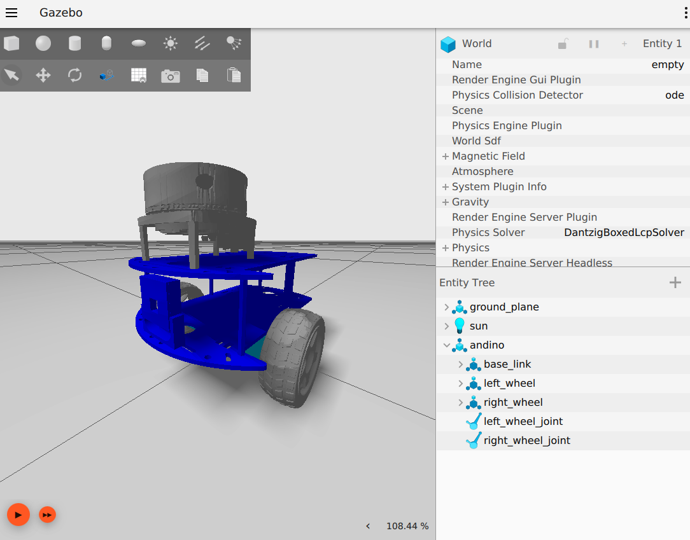

# Andino in Gazebo (Fortress)





### Docker

#### Prerequisites

It is a requirement to have `docker engine` already installed in the host machine.

* See [Docker Installation Guide](https://docs.docker.com/engine/install/ubuntu/)

For NVIDIA GPU support, `nvidia-container-toolkit` should be installed. *Skip this step if you don't have an NVIDIA graphics card*


* Make sure you have the drivers installed:
  ```sh
  nvidia-smi
  ```
* See [NVIDIA Container Toolkit Installation Guide](https://docs.nvidia.com/datacenter/cloud-native/container-toolkit/install-guide.html)

### Building image and running container

- Build the docker image whose default name is `docker_humble_fortress_andino`:

    ```sh
    ./docker/build.sh
    ```

- Run a docker container from `docker_humble_fortress_andino` called `andino_humble_fortress`:

    ```sh
    ./docker/run.sh
    ```

### Building and running simulation
- Inside the container, install dependencies via `rosdep`:

  ```sh
  rosdep install -i -y --rosdistro humble --from-paths src
  ```

- Build the packages:

  ```sh
  colcon build
  ```

- Source the built packages:

  ```sh
  source install/setup.bash
  ```

- Launch the simulation:

  ```sh
  ros2 launch andino_gz andino_gz.launch.py
  ```

- Looking at the topics in ROS 2 via the rosbridge:

  ```sh
  ros2 launch andino_gz gz_ros_bridge.launch.py
  ```

Make sure to review the required topics using `ign topics` and `ros2 topic` CLI tools.
Also, consider using looking at the translation entries under `andino_gz/config/bridge_config.yaml`.
