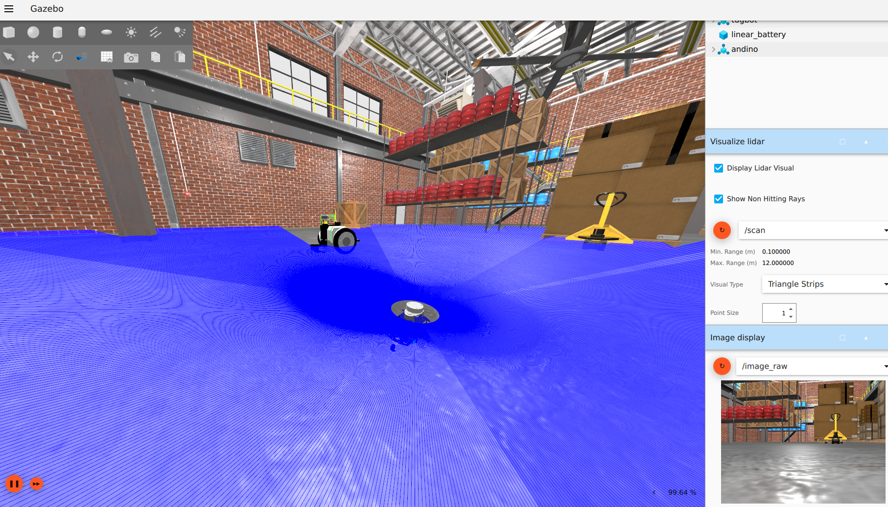

# Andino Gazebo (Fortress) Simulation




## :clipboard: Description

This package provides a simulation environment for [Andino](https://github.com/Ekumen-OS/andino) in Gazebo Fortress using [ros_gz](https://github.com/gazebosim/ros_gz) to integrate it with ROS 2.

## :clamp: Platforms

- ROS 2: Humble Hawksbill
- OS:
  - Ubuntu 22.04 Jammy Jellyfish
- Gazebo:
  - Fortress

## :inbox_tray: Installation

This package makes use of some packages from https://github.com/Ekumen-OS/andino repository. Therefore, the repository is brought as a git submodule.
For so, when cloning this repository make sure to also init the submodules, this can be done adding a `--recursive` flag to the `git clone` command

1. Clone this repository

```sh
git clone git@github.com:ekumenlabs/andino_gz.git --recursive
```

2. Set up docker environment:
Refer to [docker readme](docker/README.md)

Once the container is running and dependencies have been installed you can proceed to package building.

## :package: Build

The package contains some dependencies that must be installed in order to build it:

```
rosdep install --from-paths src -i -y
```

Then build the package and source the install workspace. To do so run the following commands:

```sh
colcon build
source install/setup.bash
```

## :rocket: Usage

Once the package is built and sourced, you can start a simulation.

  ```sh
  ros2 launch andino_gz andino_gz.launch.py
  ```

If you'd like to work from ROS you can launch the ros bridge via:

  ```sh
  ros2 launch andino_gz gz_ros_bridge.launch.py
  ```

Make sure to review the required topics using `ign topics` and `ros2 topic` CLI tools.
Also, consider using looking at the translation entries under `andino_gz/config/bridge_config.yaml`.

## :raised_hands: Contributing

Issues or PRs are always welcome! Please refer to [CONTRIBUTING](CONTRIBUTING.md) doc.

## Code development

Note that a [`Docker`](./docker) folder is provided for easy setting up the workspace.
